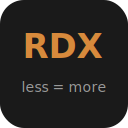
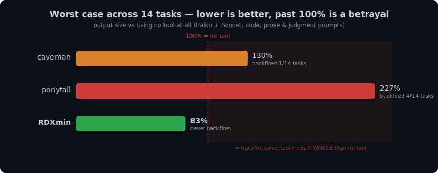

<p align="center">
  
</p>

<h1 align="center">🧨 RDXmin</h1>

<p align="center">
  <em>Your AI talks less, builds less, reads less — and says more. Like a senior dev who bills by the syllable.</em>
</p>

<p align="center">
  
  
  <a href="https://github.com/JayPokale/RDXmin/actions/workflows/test.yml"></a>
  
  
  
</p>

<p align="center">
  <strong>Half the output bill on 20 measured tasks &middot; compresses what the model writes AND reads &middot; one command</strong>
</p>

---

You asked your AI agent to "add a cache." A bare agent answered with a **150-line** cache class — config object, TTL logic, stats counters, the works. RDXmin's answer to the same prompt: **7 lines.** Same model, same question, measured, receipts committed in [`benchmarks/`](benchmarks/results/).

Most efficiency tools compress one thing. RDXmin compresses **three**:

| axis | what | how |
|---|---|---|
| **Output: prose** | filler, hedging, manufactured structure | zero-fluff ruleset, injected per session |
| **Output: code** | speculative abstractions, unrequested boilerplate | YAGNI efficiency ladder |
| **Input: context** | oversized tool output flooding the window | `PostToolUse` hook — scrub, elide, dedup — plus prevention rules |

Every "be concise" tool has a worst day — the day it makes the model write *more* than no tool at all. Across 20 measured tasks over two suites, the specialists had that day **6** and **8** times, blowing up to **424%** of the baseline. RDXmin had it **once**, capped at 173% — and that one failure was root-caused, fixed in the ruleset, and re-validated live at 93%, with the whole investigation [committed to the repo](benchmarks/results/2026-07-07-verify-rerun.md). Think of it as downside insurance for your token bill: not always the single cheapest answer, always the smallest worst case — from the only tool in this class that publishes its own failures. [Why not caveman or ponytail? →](docs/comparison.md)

---

## Install

One command. Auto-detects your agents (Claude Code, Cursor, Windsurf, Cline, Kiro, Codex, Gemini, Copilot) and wires each one. `--uninstall` puts everything back.

```bash
npx rdxmin
```

```bash
# or via curl
curl -fsSL https://raw.githubusercontent.com/JayPokale/RDXmin/main/install.sh | bash
```

```powershell
# Windows
irm https://raw.githubusercontent.com/JayPokale/RDXmin/main/install.ps1 | iex
```

Preview first with `npx rdxmin --dry-run`, scope with `--only claude`, see everything with `npx rdxmin --help`. Remove with `npx rdxmin --uninstall`.

**Requirements:** Node ≥18 (installer / `npx`) · Claude Code for live `/rdx` switching, the statusline badge, and input-side compression — the always-on ruleset still ships to every other agent · bash for the statusline (macOS/Linux; a PowerShell version ships for Windows).

### Claude Code plugin (marketplace)

```bash
claude plugin marketplace add JayPokale/RDXmin   # register the marketplace
claude plugin install rdxmin@rdxmin              # enable the plugin
```

<details>
<summary>Statusline badge (manual setup)</summary>

Add to `~/.claude/settings.json`:

```json
{
  "statusLine": {
    "type": "command",
    "command": "bash \"/path/to/rdxmin/hooks/rdx-statusline.sh\""
  }
}
```
</details>

---

## Numbers

Nothing here is estimated. Every figure below is recomputed from committed raw data; the 2026-07-07 [verification writeup](benchmarks/results/2026-07-07-verify-rerun.md) re-derived the old claims from scratch, re-ran the whole suite against the competitors' **installed plugins**, and retired the one claim that didn't survive.

### Output axis — vs caveman & ponytail, 20 live tasks

**59+ live model runs** across two suites (June 4-arm matrix on Haiku + Sonnet sweep; July re-verification run). Arms differ only in the injected system prompt. Billed output tokens vs the no-tool baseline:

| | total bill (all 20 tasks) | average task | worst case | backfires |
|---|--:|--:|--:|--:|
| caveman | 80% | 98% | **424%** | 6 / 20 |
| ponytail | 68% | 91% | 227% | 8 / 20 |
| **RDXmin** | **52%** | **69%** | **173%** | **1 / 20** |

RDXmin wins all four columns: it cut the total 20-task bill **nearly in half** while the specialists managed 20–32%, and it did so with the smallest worst day and a twentieth the backfire rate.

<p align="center">
  
</p>

The bar is the whole 20-task bill; the badge is each tool's worst single day. caveman's worst day cost **4.2×** a bare model; ponytail's — a tool whose entire job is writing less — **2.3×**. RDXmin's worst day was 1.7×, it happened once, and the fix is measured and merged.

On coding tasks RDXmin is leanest (June: 22% of baseline vs caveman 46%, ponytail 29%; July: 64% vs 84% and 160%). On pure prose caveman is a hair leaner on a good day — credit where due. And in the July run all 24 answers, every arm, **graded correct**: nobody here buys token savings with wrong answers.

### Input axis — tool-output compression (Claude Code)

Measured over 171 real sessions ([receipts](benchmarks/results/2026-07-07-input-axis.md)): tool output is **67.5%** of context content, and every byte of it is re-billed on *every subsequent request* in the session (median: 171 requests). A `PostToolUse` hook shrinks it before the model reads it — deterministic, zero LLM, zero network:

| tier | what it does | loss |
|---|---|---|
| **scrub** | strips ANSI escapes, collapses blank runs and `line repeated N×` | none |
| **elide** | oversized output → head + tail, error-like lines salvaged from the cut | bounded, guarded |
| **dedup** | byte-identical repeat of a tool's previous output (same session) → one-line marker | none — the copy is already in context |

Replayed over the same 171 sessions: **~61k tokens** (full) / **~103k** (ultra) saved one-shot, ~46% off every eligible output — floor, not estimate, since each saved byte also stops being re-sent on every later request. Correctness rules: allowlist only (`Bash`, `Agent`, `WebFetch`, `WebSearch`, `Grep`, `Glob`, `mcp__*`) — never `Read`/`Edit`, whose exact bytes feed later edits. Honest ledger: dedup scored **0 hits** on this corpus (rtk-filtered at source); it's kept for the test-rerun case, kill-switchable, and labeled speculative until it earns a number. Replay it on your own transcripts:

```bash
node benchmarks/replay-compress.js        # what it would have saved you
```

Thresholds track the `/rdx` level (lite 16k / full 8k / ultra 5k chars). `stop rdx`, `RDX_COMPRESS=0`, `RDX_COMPRESS_SCRUB=0`, `RDX_COMPRESS_DEDUP=0` — every tier has an off switch.

### Prevention — the context diet

The biggest context whale (whole-file `Read`s — 5.6M chars in the measured corpus) can't be compressed without breaking later edits. So the ruleset attacks it upstream, in every agent: grep for the symbol first, read only the matching region, narrow at the source (`ls dir` not `ls -R`, pipe long output through `tail`/`grep`), never re-read what's already in context.

---

## What the output sounds like

**"Why React component re-render?"** (full)
> New object ref each render. Inline object prop = new ref = re-render. `useMemo`.

**"Why React component re-render?"** (ultra)
> Inline obj prop → new ref → re-render. `useMemo`. Why inline object at all?

**"Add a cache for API responses."** (ultra)
> No cache until profiler says so. When it does: `@lru_cache`. Hand-rolled TTL cache = bug farm with hit rate.

---

## Usage

| Command | Effect |
|---------|--------|
| *(nothing)* | On automatically at `full` every session after install |
| `/rdx` | Re-activate at default level if you'd stopped it |
| `/rdx lite` | Tighter prose, flags the minimal alternative |
| `/rdx full` | Full compression + YAGNI ladder enforced |
| `/rdx ultra` | Extremist — abbreviate prose, delete before add, challenge requirements |
| `stop rdx` | Deactivate (ruleset *and* input-side compression) |
| `normal mode` | Deactivate |

Natural language works too: "activate rdx", "rdx mode", "rdxify this". Across every level, code symbols, function/API names, and error strings stay verbatim — only the noise around them compresses.

---

## How it works

Before writing code, the agent stops at the first rung that holds:

```
1. Does this need to exist?   → no: skip it (YAGNI)
2. Already in this codebase?  → reuse it, don't rewrite
3. Stdlib does it?            → use it
4. Native platform feature?   → use it
5. Installed dependency?      → use it
6. One line?                  → one line
7. Only then: the minimum that works
```

The ladder runs *after* reading the code — lazy about the solution, never about understanding. Lazy is not negligent: trust-boundary validation, data-loss handling, security, and accessibility are never on the chopping block.

Mark deliberate simplifications so "later" doesn't quietly become "never":

```js
// rdx: global lock, per-account locks if throughput matters
// rdx: O(n) scan, index this when table exceeds ~10k rows
```

---

## Statusline

Badge shows the active level plus measured input-side savings. Plan users see rate-limit usage + reset countdown:

```
[RDX:ULTRA] Session: ███████░░░ 73% ⟳2h14m | Weekly: ████░░░░░░ 41% ⟳3d4h ⇣9k tok
```

API-key users have no rate limits, so they see session cost instead:

```
[RDX:ULTRA] Session: $0.42 ⇣9k tok
```

Orange. Rate limits pulled live from Claude's statusline JSON; the `⇣` figure is chars actually elided by the compressor (a real baseline — no fabricated counters). Renders nothing when rdx is off.

---

## Config

**On by default.** After install, RDX activates automatically at `full` every session — no `/rdx` needed. Change the default level, or set `off` to stay dormant until you type `/rdx`:

```bash
# env var (highest priority)
export RDX_DEFAULT_MODE=ultra

# config file (persists across shells)
~/.config/rdxmin/config.json → { "defaultMode": "ultra" }
```

Resolution: env var → config file → `full`. Valid: `off`, `lite`, `full`, `ultra`.

---

## Prior art & what stacks with it

RDXmin borrows the best published token-saving techniques and implements the ones that fit a zero-dep hook; the rest stack cleanly alongside it:

| technique | source | in RDXmin? |
|---|---|---|
| Prose compression persona | [caveman](https://github.com/JuliusBrussee/caveman) | ✅ + code judgment it lacks |
| YAGNI/lazy-code ruleset | [ponytail](https://github.com/dietrichgebert/ponytail) | ✅ + prose discipline it lacks |
| Tool-output elision (head/tail) | [headroom](https://github.com/headroomlabs-ai/headroom)-style, proxy-free | ✅ hook, no proxy — works on subscription OAuth |
| ANSI strip / log crush / dedup | headroom transforms | ✅ scrub + dedup tiers |
| Command rewriting at the source | RTK-style `PreToolUse` ([writeup](https://andrewpatterson.dev/posts/token-savings-rtk-headroom/)) | ❌ stacks — RTK shrinks at source, RDXmin catches what it can't reach (subagents, MCP, web) |
| MCP/codebase-graph indexing | context-mode, [token-optimizer-mcp](https://github.com/ooples/token-optimizer-mcp) | ❌ stacks — orthogonal layer |
| CLAUDE.md dieting | [community guides](https://www.firecrawl.dev/blog/claude-code-token-efficiency) | ✅ `/rdx-audit` flags bloated docs/config prose |

## Multi-agent

Primarily a Claude Code plugin, but ships to every agent with a rules/context file — Cursor, Windsurf, Cline, Kiro, Codex, Gemini, Copilot. Per-agent copies generated by `scripts/build-rules.js` (a condensed mirror of the skill — edit both, CI checks sync). See [`docs/agent-portability.md`](./docs/agent-portability.md). Input-side compression is Claude Code-only for now: no other agent exposes a post-tool output rewrite hook.

## FAQ

**Doesn't injecting a persona every turn cost tokens?**
Yes — a one-time ruleset at session start (~1.8k tokens) plus a ~40-token reminder per turn. Output is where it pays back: coding answers shrink 40–60% (benchmarks), and output bills several × higher than input, so net is positive after the first couple of turns. On a one-line throwaway prompt the overhead can exceed the saving. The input-side hook has no such tradeoff — it only ever removes tokens.

**Will it golf my code into clever one-liners?**
No. Boring over clever. Deletion beats addition; obfuscation isn't deletion.

**Does it cut corners on safety?**
Never. Input validation, data-loss handling, security, and accessibility are off the table. Lazy about solutions, not about reading the problem.

**Can the output compressor eat a line I needed?**
Designed not to: allowlist keeps `Read`/`Edit` exact, error-looking lines are salvaged from any elided region, dedup only fires on byte-identical same-session repeats, and every tier has a kill switch. If it still bites you, file an issue — that's a bug, not the design.

**0 GitHub stars. Should I be worried?**
Everyone starts at zero. Run `npx rdxmin --dry-run`, see what it'd do, decide. No commitment, no stars required.

→ [More FAQ and competitor comparison](docs/comparison.md)

---

## Contributing

See [CONTRIBUTING.md](CONTRIBUTING.md). Edit the skill (`skills/rdx/SKILL.md`) **and** the condensed rule body in `scripts/build-rules.js`, regenerate copies and chart, run the tests. CI enforces all three.

```bash
npm test    # 56 tests: flag safety, tracker, settings merge, installer, compressor
```

## License

[MIT](LICENSE). The shortest license that works.
